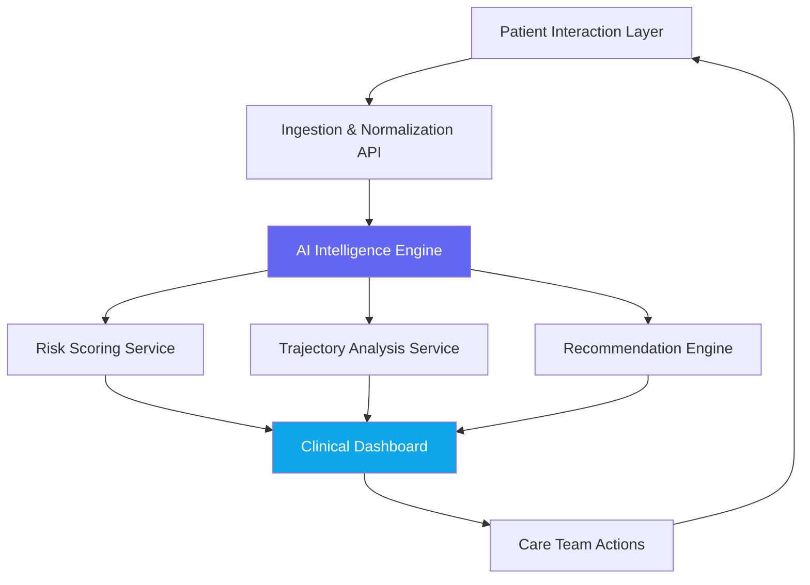

<div align="center">

# Lumina

### *From signal to care. From data to empathy.*

**An AI-native mental health intelligence platform that helps clinical teams detect psychosocial risk earlier, support care journeys with greater precision, and act with confidence — without replacing the human at the center of care.**

---

[](LICENSE)
[](https://python.org)
[](https://nextjs.org)
[](https://fastapi.tiangolo.com)
[](https://typescriptlang.org)
[]()

</div>

---

> **Sobre este repositório** — Lumina é um exercício de ideação de produto. O código é ilustrativo e os documentos representam uma proposta conceitual arquiteturalmente fundamentada. Este repositório não é um sistema em produção — é um artefato de design thinking: rigoroso na análise do problema, preciso na proposta de solução, honesto sobre o que ainda não existe.
>
> 📌 Operational status: see [`docs/REPO_STATUS.md`](docs/REPO_STATUS.md)

---

## The Problem

Mental health care operates in a fog.

Clinical teams face overwhelming caseloads, fragmented information, and no reliable way to distinguish who is deteriorating from who is stable — until a crisis makes the answer undeniable. By then, the window for early intervention has already closed.

The consequences are systemic:
- **Triage is reactive**, not predictive
- **Care journeys are discontinuous** — patients fall through the cracks between appointments
- **Clinical decision-making is data-poor** despite the existence of relevant signals
- **Teams burn out** from administrative overhead, not from caring too much

There is a gap between the data that exists and the insight that reaches the clinician at the right moment.

**Lumina closes that gap.**

---

## The Solution

Lumina is a **proposed** clinical intelligence platform that would apply AI to the ambient signals of mental health care — structured assessments, session notes, care interactions, and longitudinal data — to provide mental health professionals with **actionable, evidence-informed insights** precisely when they need them.

It would not replace clinical judgment. It would amplify it.

```
Patient signal → Lumina intelligence layer → Clinician insight → Better care decision
```

Lumina operates across three core capabilities:

| Capability | What it does |
|---|---|
| **Intelligent Triage** | Analyzes incoming signals to prioritize patient attention by psychosocial risk |
| **Care Journey Intelligence** | Tracks continuity of care, flags gaps, and models longitudinal patient trajectories |
| **Clinical Decision Support** | Surfaces evidence-based recommendations tailored to individual patient context |

---

## Key Differentials

- **AI designed for clinical responsibility** — every output includes confidence indicators and evidence references, never raw predictions
- **Ethics-first architecture** — the AI layer is explicitly bounded by clinical safety constraints (see [`ethics/`](ethics/))
- **Designed for teams, not just patients** — insights are structured for care coordination, not just individual assessment
- **Explainable by design** — no black-box scores; every risk flag includes the reasoning behind it
- **Built on validated clinical frameworks** — PHQ-9, GAD-7, Columbia Suicide Severity Rating Scale, and others inform the risk models
- **Human override as a first-class feature** — clinicians can always annotate, dismiss, or escalate any AI suggestion

---

## Architecture Overview



The proposed platform follows a **layered intelligence architecture**:

1. **Ingestion Layer** — standardizes inputs from assessments, EHR extracts, and direct interactions
2. **AI Engine** — processes signals through specialized LLM prompts calibrated for clinical safety
3. **Risk & Trajectory Services** — compute multi-dimensional psychosocial risk scores and patient trajectories
4. **Clinical Interface** — presents structured insights, priority queues, and care recommendations to teams
5. **Audit Layer** — every AI output is logged, timestamped, and explainable for clinical governance

---

## Technology Stack

### Backend
- **Runtime**: Python 3.11
- **Framework**: FastAPI
- **AI**: Anthropic Claude API (via structured clinical prompts)
- **Database**: PostgreSQL 15 + Redis 7 (session cache)
- **Auth**: JWT + Role-based access control
- **Infrastructure**: Docker + Docker Compose

### Frontend
- **Framework**: Next.js 14 (App Router)
- **Language**: TypeScript 5
- **Styling**: Tailwind CSS 3
- **State**: Zustand + React Query
- **Charts**: Recharts
- **Component library**: Radix UI primitives

### AI & Clinical Logic
- **LLM Provider**: Anthropic Claude
- **Prompt architecture**: Structured clinical prompts with safety constraints (see [`prompts/`](prompts/))
- **Risk frameworks**: PHQ-9, GAD-7, C-SSRS, WHO-5
- **Output format**: Structured JSON with confidence scores, evidence references, and clinical flags

---

## Use Cases

### 1. Morning Clinical Huddle Support
A care coordinator opens Lumina before the daily team meeting. The platform surfaces the three patients with the most significant risk signal changes in the past 48 hours, with a summary of what changed and why. The team can prioritize their morning accordingly.

### 2. Between-Session Monitoring
A patient completes a brief digital check-in on day 5 of a 10-day gap between sessions. Lumina detects a pattern consistent with worsening anhedonia and generates a flag for the assigned clinician — not an alarm, but a prompt to consider a brief outreach call.

### 3. Intake Triage for New Patients
An admissions coordinator inputs structured assessment data from an intake form. Lumina returns a risk profile within seconds — not a diagnosis, but a structured prioritization recommendation with supporting evidence, helping the team allocate the next available specialist appropriately.

### 4. Care Gap Detection
Lumina identifies that a high-risk patient has had no recorded care contact in 18 days — outside the agreed care plan cadence. A care coordinator is automatically notified to attempt re-engagement before the gap becomes a dropout.

### 5. Team Insights & Capacity Planning
A clinical director reviews aggregate, de-identified team data to understand caseload distribution, risk concentration, and service utilization — enabling evidence-based resource allocation decisions.

---

## Ethical Commitments

This conceptual platform is designed with the understanding that AI in mental health carries extraordinary responsibility. Core design commitments:

- **Lumina does not diagnose.** It surfaces risk signals to inform clinical attention.
- **Lumina does not replace crisis intervention.** Suicidal ideation signals trigger mandatory human escalation, not AI responses.
- **Lumina does not make treatment decisions.** All care recommendations are advisory and explicitly framed as such.
- **Lumina operates under clinician authority.** The platform provides intelligence; the clinician retains all authority over care.
- **Privacy is not a feature — it is a foundation.** All patient data is encrypted, access-controlled, and fully auditable.

Full ethical framework: [`ethics/ETHICS_AND_SAFETY.md`](ethics/ETHICS_AND_SAFETY.md)

---

## Project Structure

```
lumina-care/
├── src/
│   ├── api/                    # FastAPI backend
│   │   ├── main.py             # Application entrypoint
│   │   ├── routers/            # API route handlers
│   │   │   ├── triage.py       # Triage endpoints
│   │   │   ├── insights.py     # Insights & recommendations
│   │   │   └── patients.py     # Patient data management
│   │   ├── models/             # Pydantic data models
│   │   │   ├── triage.py       # Triage request/response models
│   │   │   └── patient.py      # Patient data models
│   │   └── services/           # Business logic layer
│   │       ├── ai_service.py   # Claude API integration
│   │       └── risk_analysis.py # Psychosocial risk computation
│   └── web/                    # Next.js frontend
│       ├── app/                # App Router pages
│       └── components/         # Reusable UI components
├── docs/                       # Strategic documentation
│   ├── PRODUCT_VISION.md
│   ├── PROBLEM_STATEMENT.md
│   ├── USER_PERSONAS.md
│   ├── USE_CASES.md
│   ├── SOLUTION_OVERVIEW.md
│   ├── SYSTEM_ARCHITECTURE.md
│   ├── AI_STRATEGY.md
│   ├── ETHICS_AND_SAFETY.md
│   ├── ROADMAP.md
│   └── FAQ.md
├── prompts/                    # AI prompt templates
│   ├── triage_analysis.md
│   ├── risk_assessment.md
│   └── care_recommendations.md
├── ethics/                     # Ethical framework documents
├── research/                   # Clinical literature & references
├── pitch/                      # Executive summary & investor brief
├── demo/                       # Demo scenarios & walkthroughs
├── docker-compose.yml
└── README.md
```

---

## Proposta de Implementação

> O código neste repositório é **ilustrativo** — representa como a arquitetura proposta seria estruturada, não um sistema funcional pronto para execução. Os comandos abaixo descrevem a implementação de referência.

### Stack de referência
- Docker & Docker Compose
- Node.js 18+ / Python 3.11+
- PostgreSQL 15 + Redis 7
- Anthropic API key

### Fluxo de setup proposto

```bash
git clone https://github.com/moisesandradee/lumina-care.git
cd lumina-care

cp .env.example .env
# Configurar variáveis de ambiente conforme documentado em .env.example

docker-compose up --build
# API: http://localhost:8000 | Web: http://localhost:3000
```

### API proposta

| Método | Endpoint | Função |
|---|---|---|
| `POST` | `/api/v1/triage/analyze` | Análise de risco a partir de dados do paciente |
| `GET` | `/api/v1/triage/queue` | Fila priorizada de atenção clínica |
| `GET` | `/api/v1/patients/{id}/insights` | Insights de IA para paciente específico |
| `POST` | `/api/v1/patients/{id}/assessment` | Registro de nova avaliação clínica |
| `GET` | `/api/v1/insights/team-summary` | Painel agregado de inteligência de equipe |
| `POST` | `/api/v1/triage/{id}/override` | Override clínico / anotação profissional |

---

## Roadmap

See [`docs/ROADMAP.md`](docs/ROADMAP.md) for the full roadmap with milestones.

| Phase | Focus | Status |
|---|---|---|
| **Phase 1 — Foundation** | Core triage engine, API, data models | 📐 Conceito |
| **Phase 2 — Intelligence** | Risk scoring, trajectory analysis, LLM integration | 📋 Planned |
| **Phase 3 — Interface** | Clinical dashboard, care coordinator view | 📋 Planned |
| **Phase 4 — Integration** | EHR connectors, HL7 FHIR support | 📋 Planned |
| **Phase 5 — Scale** | Multi-tenant, audit compliance, clinical validation | 📋 Planned |

---

## Impact Vision

Mental health is the defining public health challenge of our time. Over 970 million people globally live with a mental health condition. The treatment gap — the difference between those who need care and those who receive it — exceeds 70% in most countries.

Technology alone will not close this gap. But technology designed with clinical rigor, ethical discipline, and genuine empathy for both the clinician and the patient can meaningfully shift the odds.

Lumina is a bet on that possibility.

---

## Colaboração

Contribuições ao projeto de ideação são bem-vindas, especialmente de:
- Profissionais de saúde mental dispostos a revisar a lógica clínica e os casos de uso
- Engenheiros com experiência em dados de saúde e segurança em IA
- Pesquisadores em psiquiatria computacional e NLP clínico

Issues e discussões são o canal preferido para contribuições conceituais.

---

## License

MIT License — see [LICENSE](LICENSE) for details.

---

<div align="center">

**Lumina** — Built with rigor. Designed with empathy.

*The best technology in mental health is invisible to the patient and indispensable to the clinician.*

</div>
