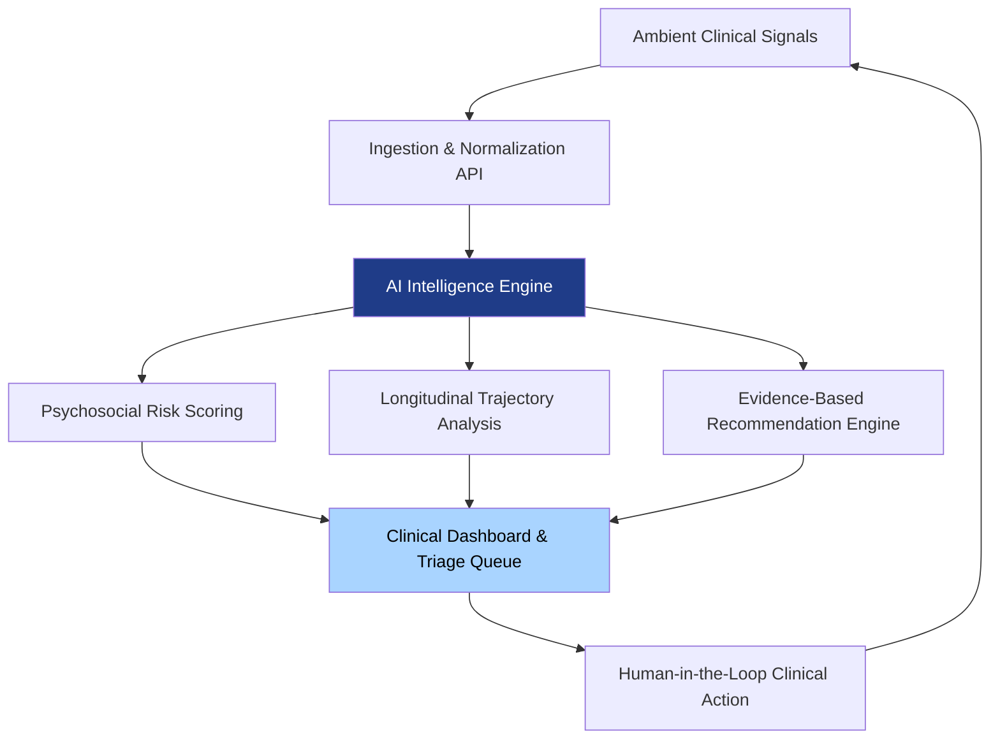

# LUMINA CARE: Clinical Intelligence & Human-Centered Design

### *Translating ambient clinical signals into actionable, empathetic care.*

---

> **Abstract** — Lumina Care is a research-driven clinical intelligence platform designed to bridge the gap between fragmented healthcare data and actionable human care. By applying advanced natural language processing and machine learning to ambient clinical signals, Lumina provides care teams with predictive insights, longitudinal trajectory modeling, and evidence-based decision support. This repository serves as a foundational architecture for building AI systems that amplify, rather than replace, clinical judgment.

---

## 1. THE CLINICAL INFORMATION GAP

Modern healthcare systems suffer from a paradox of data abundance and insight scarcity. Clinical teams navigate overwhelming caseloads and fragmented Electronic Health Records (EHRs), leading to reactive triage and discontinuous care journeys. The critical signals indicating patient deterioration are often buried in unstructured notes or isolated data silos, rendering them invisible until a crisis occurs.

The systemic consequences are profound:
- **Reactive Intervention:** Triage relies on lagging indicators rather than predictive modeling.
- **Care Fragmentation:** Patients experience gaps in continuity between discrete clinical encounters.
- **Cognitive Overload:** Clinicians face burnout from administrative burden and data synthesis, detracting from direct patient care.

**Lumina Care proposes a paradigm shift: transforming latent data into visible, actionable care.**

---

## 2. SYSTEM ARCHITECTURE & CAPABILITIES

Lumina Care operates as an intelligence layer situated between raw clinical data and the care team. It does not generate diagnoses; it synthesizes signals to prioritize attention and support clinical reasoning.

### Core Computational Modules

| Module | Function & Methodology |
| :--- | :--- |
| **Intelligent Triage Engine** | Utilizes NLP to analyze incoming assessments and notes, computing multi-dimensional risk scores based on validated clinical frameworks (e.g., PHQ-9, GAD-7). |
| **Trajectory Modeling** | Employs time-series analysis to track continuity of care, identifying deviations from expected recovery paths and flagging potential care gaps. |
| **Decision Support System** | Surfaces context-aware, evidence-based recommendations, explicitly linking AI outputs to peer-reviewed clinical guidelines. |

---

## 3. ETHICAL AI & CLINICAL GOVERNANCE

The deployment of AI in healthcare demands rigorous ethical constraints. Lumina Care is built upon a foundation of "Ethics-by-Design," ensuring that technology serves as an augmentation of human empathy, not a substitute.

- **Explainability (XAI):** Black-box algorithms are strictly avoided. Every risk flag and recommendation includes a transparent audit trail detailing the underlying data signals and clinical reasoning.
- **Human-in-the-Loop (HITL):** The system is designed to require clinical validation. Professionals maintain absolute authority to annotate, override, or dismiss AI-generated insights.
- **Safety Boundaries:** The architecture includes hardcoded safety protocols. For instance, signals indicating acute crisis (e.g., suicidal ideation) bypass standard processing queues to trigger immediate, mandatory human escalation.

---

## 4. TECHNOLOGY STACK

The platform is engineered for scalability, security, and interoperability within complex healthcare IT environments.

### Backend Infrastructure
- **Runtime:** Python 3.11 (Optimized for data science and ML workloads)
- **Framework:** FastAPI (High-performance, asynchronous API routing)
- **Intelligence Layer:** Integration with Large Language Models (e.g., Anthropic Claude) via structured, clinically-constrained prompts.
- **Data Persistence:** PostgreSQL 15 (Relational data) + Redis 7 (High-speed caching)

### Frontend Interface
- **Framework:** Next.js 14 (React-based, server-side rendering for performance)
- **Language:** TypeScript 5 (Ensuring type safety and robust state management)
- **Design System:** Tailwind CSS + Radix UI (Accessible, human-centered interface design)

---

## 5. RESEARCH & DEVELOPMENT ROADMAP

Lumina Care is an evolving ecosystem. Our development trajectory focuses on rigorous validation and progressive integration.

| Phase | Focus Area | Objective |
| :--- | :--- | :--- |
| **Phase I** | Foundation & Modeling | Establish core NLP pipelines and risk scoring algorithms based on retrospective datasets. |
| **Phase II** | Interface & Usability | Develop the clinical dashboard, prioritizing cognitive ergonomics and reducing alert fatigue. |
| **Phase III** | Interoperability | Implement HL7 FHIR standards for seamless bidirectional data exchange with major EHR systems. |
| **Phase IV** | Clinical Validation | Conduct prospective clinical trials to measure impact on triage efficiency and patient outcomes. |

---

## 6. COLLABORATION & OPEN SCIENCE

We believe that solving systemic healthcare challenges requires collaborative innovation. We welcome contributions from:
- **Clinical Researchers:** To validate risk models and refine use cases.
- **Data Scientists & Engineers:** To optimize NLP pipelines and enhance system architecture.
- **UX/UI Designers:** To advance human-computer interaction in clinical settings.

Please refer to our contribution guidelines for protocols on submitting research, code, or design proposals.

---

## 7. LICENSE

This project is licensed under the MIT License. See the `LICENSE` file for full details.

**Lumina Care**
*Mens et Manus applied to human health.*

